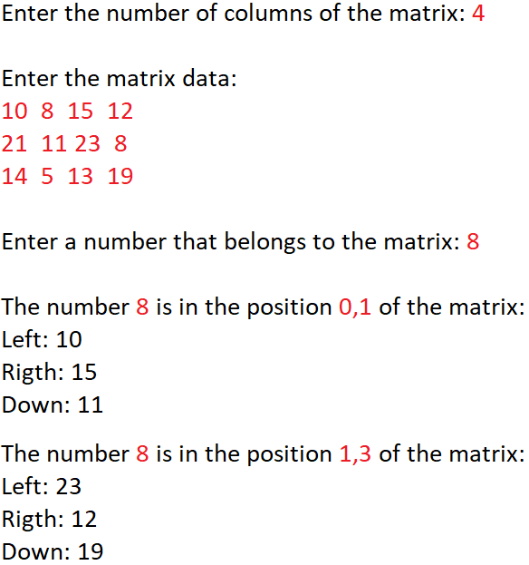

<p align="center"><strong>💻 Atualizado em 09 de Setembro de 2021 💻</strong></p>

<h2 align="center">Exercícios Linguagem JAVA</h2>

<!-- Aumento Salário dos Funcionários -->
 <details>
  <summary><strong>Aumento Salário</strong></summary>
    <br/>
 
 <div align="center"><h3>ENUNCIADO<h3></div>

```
Fazer um programa para ler um número inteiro N e depois os dados (id, nome e salario) de N funcionários. Não 
deve haver repetição de id. 
 
Em seguida, efetuar o aumento de X por cento no salário de um determinado funcionário. Para isso, o programa
deve ler um id e o valor X. Se o id informado não existir, mostrar uma mensagem e abortar a operação. 
Ao final, mostrar a listagem atualizada dos funcionários, conforme exemplos.
 
Lembre-se de aplicar a técnica de encapsulamento para não permitir que o salário possa ser mudado livremente. 
Um salário só pode ser aumentado com base em uma operação de aumento por porcentagem dada.
```


<div align="center"><h3>RESULTADO 1<h3></div>
 
```
How many employees will be registered? 3

Emplyoee #1:
Id: 333
Name: Maria Brown
Salary: 4000.00

Emplyoee #2:
Id: 536
Name: Alex Grey
Salary: 3000.00

Emplyoee #3:
Id: 772
Name: Bob Green
Salary: 5000.00

Enter the employee id that will have salary increase : 536
Enter the percentage: 10.0

List of employees:
333, Maria Brown, 4000.00
536, Alex Grey, 3300.00
772, Bob Green, 5000.00
```

<div align="center"><h3>RESULTADO 2<h3></div>

```
How many employees will be registered? 2

Emplyoee #1:
Id: 333
Name: Maria Brown
Salary: 4000.00

Emplyoee #2:
Id: 536
Name: Alex Grey
Salary: 3000.00

Enter the employee id that will have salary increase: 776
This id does not exist!

List of employees:
333, Maria Brown, 4000.00
536, Alex Grey, 3000.00
```
</details>

<details>

<summary><strong>Matriz M e N Posição</strong></summary>
    <br/>
 
 <div align="center"><h3>ENUNCIADO<h3></div>

```
Fazer um programa para ler dois números inteiros M e N, e depois ler uma matriz de M linhas por N colunas
contendo números inteiros, podendo haver repetições. Em seguida, ler um número inteiro X que pertence à 
matriz. Para cada ocorrência de X, mostrar os valores à esquerda, acima, à direita e abaixo de X, quando 
houver, conforme exemplo.
```

<div align="center"><h3>RESULTADO<h3></div>
 
```
<p align="center">
  
</p>
```
 </details>